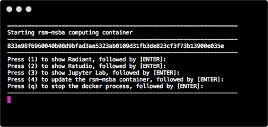

## Installing the RSM-MSBA computing environment on Linux (Ubuntu 18.04)

Please follow the instructions below to install the computing environment we will use in the MSBA program. The environment has R, Rstudio, Python, and Jupyter lab + plus required packages pre-installed. The environment will be consistent across all students and faculty, easy to update, and also easy to remove if desired (i.e., there will *not* be dozens of pieces of software littered all over your computer).

Important: You *must* complete the installation before our first class session on 8/6 or you will not be able to work on in-class exercises!

**Step 1**: Install docker using the steps described at the link below. Once you have installed docker make sure it is running. You can can check this by running the following command.

```bash
docker ps -q
```

https://www.digitalocean.com/community/tutorials/how-to-install-and-use-docker-on-ubuntu-18-04


Optional: If you are interested, the linked video gives a brief intro to what Docker is: https://www.youtube.com/watch?v=YFl2mCHdv24

**Step 2**: Open a terminal and copy-and-paste the code below.

```bash
git clone https://github.com/radiant-rstats/docker.git ~/git/docker
cp ~/git/docker/launch-rsm-msba.sh ~/Desktop
~/Desktop/launch-rsm-msba.sh
```

This step will start up a script that will finalize the installation of the computing environment. The first time you run this script it will download the latest version of the computing environment. Wait for the container to download and follow any prompts. Once the download is complete you should see a menu as in the screen shot below. You can press 2 (and Enter) to start Rstudio. Press 3 (and Enter) to start Jupyter Lab. Press q to quit. For Rstudio the username and password are both "rstudio". For Jupyter the password is "jupyter"



The code above also created a copy of the file `launch-rsm-msba.sh` on your Desktop that you can use to "fire up" the container again in the future.

**Step 3**: Check that you can launch Rstudio and Jupyter

You will know that installation was successful if you can now run Rstudio and Jupyter. When you press 2 (+ enter) in the terminal, Rstudio should start up in your default web browser. If you press 3 (+ enter) Jupyter Lab should start up in another tab in your web browser. 

As mentioned above, for Rstudio the username and password are both "rstudio". For Jupyter Lab the password is "jupyter".

**Rstudio**:


**Jupyter**:


## Updating the RSM-MSBA computing environment on Linux

To update the container use the launch script and press 6 (+ enter). To update the launch script itself, press 7 (+ enter).


If for some reason you are having trouble updating either the container or the launch script open a terminal and copy-and-paste the code below. These commands will update the docker container, replace the old docker related scripts, and copy the latest version of the launch script to your Desktop.

```bash
docker pull vnijs/rsm-msba
rm -rf ~/git/docker
git clone https://github.com/radiant-rstats/docker.git ~/git/docker
cp ~/git/docker/launch-rsm-msba.sh ~/Desktop
```
