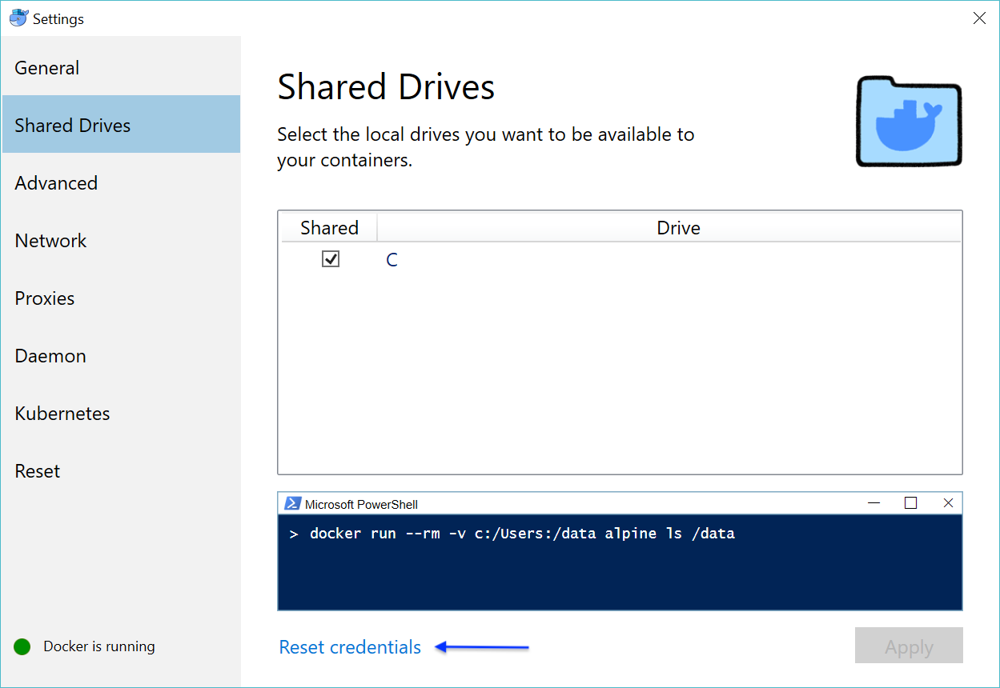

# Contents
  - [Installing the RSM-MSBA computing environment on Windows](#installing-the-rsm-msba-computing-environment-on-windows) 
  - [Updating the RSM-MSBA computing environment on Windows](#updating-the-rsm-msba-computing-environment-on-windows) 
  - [Extended functionality with Apache Spark](#extended-functionality-with-apache-spark)
  - [Installing R and Python packages locally](#installing-r-and-python-packages-locally)
  - [Trouble shooting](#trouble-shooting)

## Installing the RSM-MSBA computing environment on Windows

Please follow the instructions below to install the computing environment we will use in the MSBA program. The environment has R, Rstudio, Python, and Jupyter lab + plus required packages pre-installed. The environment will be consistent across all students and faculty, easy to update, and also easy to remove if desired (i.e., there will *not* be dozens of pieces of software littered all over your computer).

**Step 1**: Upgrade Windows if you are currently using Windows Home Edition

Windows users **must** use Microsoft Windows 10 Professional, Education, or Enterprise (64-bit). Students will most likely be able to download Microsoft Windows 10 Education (64-bit) for free through their university

**Step 2**: Install docker from the link below and make sure it is running. You will know it is running if you see the icon below in your system tray. If the containers shown in in the image are moving up and down docker hasn't finished starting up yet.

During the install process use *only* the default settings. You may be prompted to enable virtualization ("Hyper-V"). If so, click OK and your computer will restart.


https://download.docker.com/win/stable/Docker%20for%20Windows%20Installer.exe 

Once the install is done, right click on the docker icon, select "Settings", and make sure that "C" is checked as a shared drive as in the image below


You can also change the (maximum) resources docker is allowed to use on your system. You can set this (close) to the maximum available on your system.


Optional: If you are interested, the linked video gives a brief intro to what Docker is: https://www.youtube.com/watch?v=YFl2mCHdv24

**Step 3**: Install git bash from the link below

https://git-scm.com/download/win 

Keep the default settings until you are asked about "Configuring extra options". Set the options as shown in the screen shot below. 


There is no is no need to "View Release Notes" on the last screen but do "Launch Git Bash" as this will get you started on **step 4**.


**Step4**: Open a bash terminal and copy-and-paste the code below to add `rsync` functionality. Note: You may have to right-click to get a copy-and-paste menu for the terminal

```bash
curl http://www2.futureware.at/~nickoe/msys2-mirror/msys/x86_64/rsync-3.1.2-2-x86_64.pkg.tar.xz -o rsync.pkg.tar.xz;
tar xvJf rsync.pkg.tar.xz -C /c/Program\ Files/Git/;
rm -rf rsync.pkg.tar.xz;
```

Next, copy-and-paste the code below to clone the launch scripts needed to start the docker container. 

```bash
git clone https://github.com/radiant-rstats/docker.git C:/Users/$USERNAME/git/docker;
cp -p C:/Users/$USERNAME/git/docker/launch-rsm-msba.sh C:/Users/$USERNAME/Desktop;
C:/Users/$USERNAME/Desktop/launch-rsm-msba.sh;
```

This step finalizes the installation of the computing environment. The first time you run the launch script it will download the latest version of the computing environment. Wait for the container to download and follow any prompts. Once the download is complete you should see a menu as in the screen shot below. You can press 2 (and Enter) to start Rstudio. Press 3 (and Enter) to start Jupyter Lab. Press q to quit. For Rstudio the username if "jovyan" and the password is "rstudio". For Jupyter the password is "jupyter"


The code above also created a copy of the file `launch-rsm-msba.sh` on your Desktop that you can double-click to "fire up" the container again in the future.

**Step 5**: Check that you can launch Rstudio and Jupyter

You will know that installation was successful if you can now run Rstudio and Jupyter. When you press 2 (+ enter) in the terminal, Rstudio should start up in your default web browser. If you press 3 (+ enter) Jupyter Lab should start up in another tab in your web browser. 

As mentioned above, for Rstudio the username and password are both "rstudio". For Jupyter Lab the password is "jupyter".

**Rstudio**:


**Jupyter**:


## Updating the RSM-MSBA computing environment on Windows

To update the container use the launch script and press 4 (+ enter). To update the launch script itself, press 5 (+ enter).


If for some reason you are having trouble updating either the container or the launch script open a bash terminal and copy-and-paste the code below. Note: You may have to right-click to get a copy-and-paste menu for the terminal. These commands will update the docker container, replace the old docker related scripts, and copy the latest version of the launch script to your Desktop.

```bash
docker pull vnijs/rsm-msba;
rm -rf C:/Users/$USERNAME/git/docker;
git clone https://github.com/radiant-rstats/docker.git C:/Users/$USERNAME/git/docker;
cp -p C:/Users/$USERNAME/git/docker/launch-rsm-msba.sh C:/Users/$USERNAME/Desktop;
```

## Extended functionality with Apache Spark

Run the code below from a (bash) shell to extend the functionality of the computing container with `Apache Spark`, `pyspark`, and `sparklyr`. Use the `launch-rsm-msba-spark.sh` script on your desktop to run the container

```bash
docker pull vnijs/rsm-msba-spark;
rm -rf C:/Users/$USERNAME/git/docker;
git clone https://github.com/radiant-rstats/docker.git C:/Users/$USERNAME/git/docker;
cp -p C:/Users/$USERNAME/git/docker/launch-rsm-msba-spark.sh C:/Users/$USERNAME/Desktop;
```

## Installing R and Python packages locally

To install python packages that will persist after restarting the docker container enter code like the below from the terminal in JupyterLab:

`pip3 install --user redis`

To install R packages that will persist after restarting the docker container enter code like the below in Rstudio:

`install.packages("fortunes", lib = Sys.getenv("R_LIBS_USER"))`

To remove locally installed python packages press 7 + Enter in the docker launcher menu. To remove locally installed R packages press 6 + Enter in the docker launcher menu. 

## Trouble shooting

Check if a firewall or VPN is blocking docker access to your home directory. If this is an issue on your system, a warning should show when you check the "C" drive in docker settings and click "Apply". See screen shot below



If there is an error related to the firewall, try turning off the firewall to check if the rsm-msba container now works. You should not be without a virus checker or firewall however! We recommend using **Windows Defender**. If you are not sure if Windows Defender is correctly configured, please check with IT. 
If you are able to select the C drive and no error is shown after clicking "Apply", try clicking on "Reset Credentials" or type "docker logout" in a bash terminal.

Alternative "fixes" that have worked are to restart docker and/or restart your computer. It is best to quit any running process before you restart your computer (i.e., press q + enter in the terminal menu)
