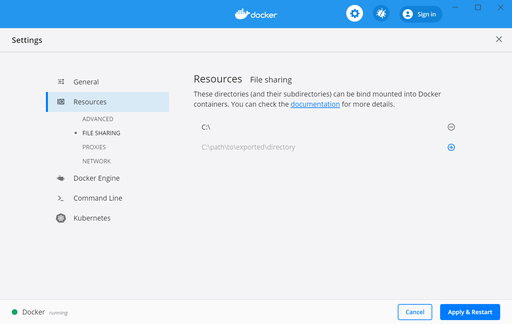

## Installing the RSM-MSBA computing environment on Windows

Please follow the instructions below to install the computing environment we will use in the MSBA program. The environment has R, Rstudio, Python, and Jupyter lab + plus required packages pre-installed. The environment will be consistent across all students and faculty, easy to update, and also easy to remove if desired (i.e., there will *not* be dozens of pieces of software littered all over your computer).

**Step 1**: Upgrade Windows if you are currently using Windows Home Edition

Windows users **must** use Microsoft Windows 10 Professional, Education, or Enterprise (64-bit). Students will most likely be able to download Microsoft Windows 10 Education (64-bit) for free through their university

**Step 2**: Install docker from the link below and make sure it is running. You will know it is running if you see the icon below in your system tray. If the containers shown in in the image are moving up and down docker hasn't finished starting up yet.

During the install process use *only* the default settings. You may be prompted to enable virtualization ("Hyper-V"). If so, click OK and your computer will restart.


https://download.docker.com/win/stable/Docker%20for%20Windows%20Installer.exe 

Once the install is done, right click on the docker icon, select "Settings", and make sure that "C" is checked as a shared drive as in the image below



Optional: If you are interested, the linked video gives a brief intro to what Docker is: https://www.youtube.com/watch?v=YFl2mCHdv24

**Step 3**: Install git bash from the link below

https://git-scm.com/download/win 

Again, follow all default settings until the last screen (see image below). There is no need to "View Release Notes" and "Launch Git Bash" will get you started on **step 4**.


**Step 4**: Open a bash terminal and copy-and-paste the code below. Note: You may have to right-click to get a copy-and-paste menu for the terminal

```bash
git clone https://github.com/radiant-rstats/docker.git C:/Users/$USERNAME/git/docker
start C:/Users/$USERNAME/git/docker
C:/Users/$USERNAME/git/docker/launch-windows.sh
```

This step will start up a script that will finalize the installation of the computing environment. The first time you run this script it will download the latest version of the computing environment. Wait for the container to download and follow any prompts. Once the download is complete you should see a menu as in the screen shot below. You can press 2 (and Enter) to start Rstudio. Press 3 (and Enter) to start Jupyter Lab. Press q to quit. For Rstudio the username and password are both "rstudio". For Jupyter the password is "jupyter"


**Step 5**: Create a shortcut to `launch-windows.sh` on your Desktop so you can easily "fire up" the container in the future. To create a shortcut, right-click on the file and choose "Send to > Desktop (create shortcut)". 


**Step 6**: Check that you can launch Rstudio and Jupyter

You will know that installation was successful if you can now run Rstudio and Jupyter. When you press 2 (+ enter) in the terminal, Rstudio should start up in your default web browser. If you press 3 (+ enter) Jupyter Lab should start up in another tab in your web browser. 

As mentioned above, for Rstudio the username and password are both "rstudio". For Jupyter Lab the password is "jupyter".

**Rstudio**:


**Jupyter**:


**Trouble shooting**:

Check if a firewall or VPN is blocking docker access to your home directory. If this is an issue on your system, a warning should show when you check the "C" drive in docker settings and click "Apply". See screen shot below


If there is an error related to the firewall, try turning off the firewall to check if the rsm-msba container now works. You should not be without a virus checker or firewall however! We recommend using **Windows Defender**. If you are not sure if Windows Defender is correctly configured, please check with IT. 

If you are able to select the C drive and no error is shown after clicking "Apply", try clicking on "Reset Credentials"

Alternative "fixes" that have worked are to restart docker and/or restart your computer. It is best to quit any running process before you restart your computer (i.e., press q + enter in the terminal menu)
