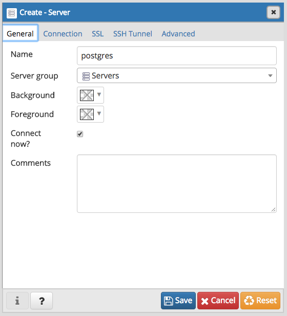
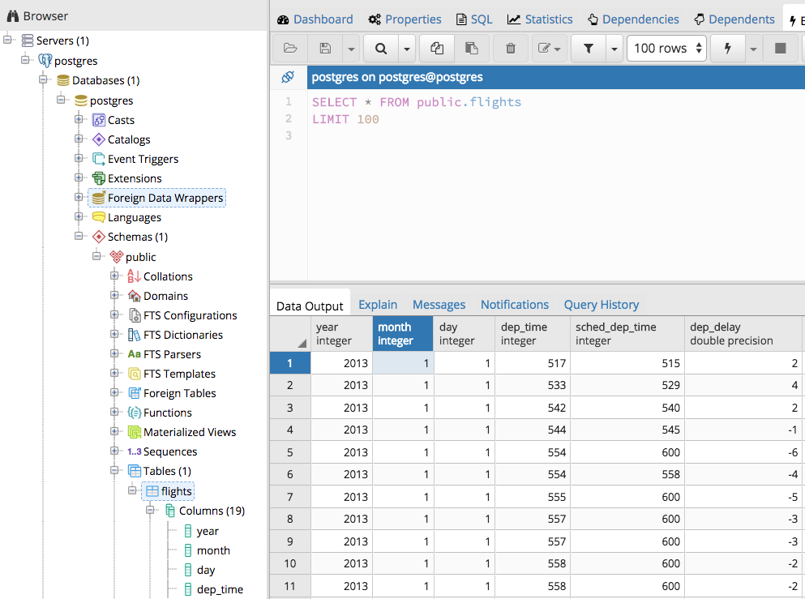

```{r setup, include=FALSE}
knitr::opts_chunk$set(echo = TRUE)
```

Start the `rsm-msba` or `rsm-msba-spark` computing container. In the menu that appears, press 4 + Enter to start the postgres server. You can connect to the database using the code chunk below.

```{r}
library(DBI)
library(RPostgreSQL)
con <- dbConnect(
  dbDriver("PostgreSQL"),
  user = "postgres", 
  host = "postgres",    ## use when establishing a connection between containers
  # host = "127.0.0.1", ## use when connection to postgres from local Rstudio
  port = 5432,
  dbname = "postgres",
  password = "postgres"
  ## can use the line below in interactive sessions
  # password = rstudioapi::askForPassword("Database password")
)
```

Is there anything in the data base? If this is not the first time you are  running this Rmarkdown file the database should be available already (i.e., the code chunk below should show "flights" as an existing table)

```{r}
library(dplyr)
db_tabs <- dbListTables(con)
db_tabs
```

If the database is empty, lets start with the example at https://db.rstudio.com/dplyr/ and work through the following 6 steps:

### 1. install the nycflights13 package if not already available

```{r}
if (!require("nycflights13")) {
  install.packages("nycflights13")
}
```

### 2. Push data into the database 

Note that this is a fairly large file that we are copying into the database so make sure you have at least a reasonable amount of resources set as available for docker. See the install instructions for details:

* Windows: https://github.com/radiant-rstats/docker/blob/master/install/rsm-msba-windows.md
* macOS: https://github.com/radiant-rstats/docker/blob/master/install/rsm-msba-macos.md
* Linux: https://github.com/radiant-rstats/docker/blob/master/install/rsm-msba-linux.md

```{r}
## only push to db if table does not yet exist
if (!"flights" %in% db_tabs) {
  copy_to(con, nycflights13::flights, "flights",
    temporary = FALSE,
    indexes = list(
      c("year", "month", "day"),
      "carrier",
      "tailnum",
      "dest"
    )
  )
}
```

### 3. Create a reference to the data base that (db)plyr can work with

```{r}
flights_db <- tbl(con, "flights")
```

### 4. Query the data base using (db)plyr

```{r}
flights_db %>% select(year:day, dep_delay, arr_delay)
flights_db %>% filter(dep_delay > 240)
flights_db %>%
  group_by(dest) %>%
  summarise(delay = mean(dep_time))

tailnum_delay_db <- flights_db %>% 
  group_by(tailnum) %>%
  summarise(
    delay = mean(arr_delay),
    n = n()
  ) %>% 
  arrange(desc(delay)) %>%
  filter(n > 100)

tailnum_delay_db
tailnum_delay_db %>% show_query()

nrow(tailnum_delay_db)

tailnum_delay <- tailnum_delay_db %>% collect()
nrow(tailnum_delay)
tail(tailnum_delay)
```

### 5. Query the data using SQL

You can specify a SQL code chunk to query the database directly

```{sql, connection = con}
SELECT * FROM flights WHERE dep_time > 2350
```

### 6. View the data in pgAdmin4

Press 5 + Enter in the menu to start `pgAdmin4`. It will run on http://localhost:5050/browser/. You can login using `admin@pgadmin.com` as the user id and `pgadmin` as the password. 

To connect to the data base, create a new "server" by right clicking on the `Server` icon and choosing _Create > Server_. In the  `General` and `Connection` tabs provide the information shown in the screen shots below and click on the `Save` icon.




See the screen shot below to access the `flights` table. Right click on `flights` and select _View/Edit Data > First 100 Rows_ to get a table view of the data. 


