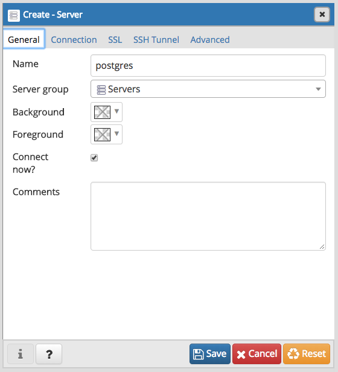
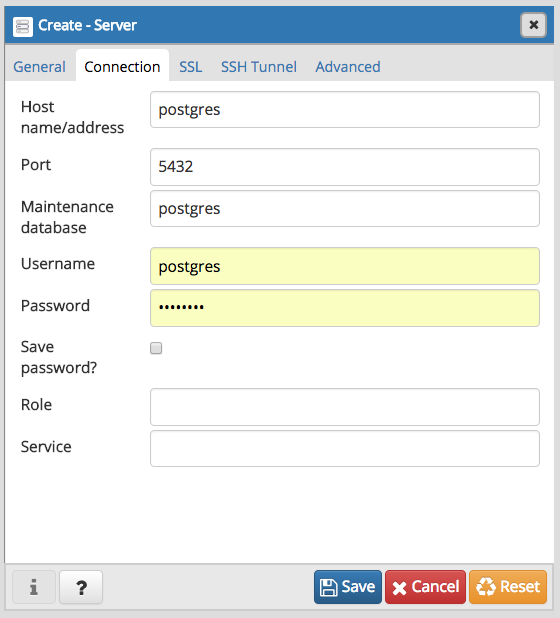

Start the rsm-msba computing container by double clicking the `launch-rsm-msba-pg.sh` file. In the menu that appears, press 4 + Enter to start the postgres server. Alternatively, copy-and-paste the command below into a (bash) shell from the `git/docker` directory.

```bash
docker-compose -f ./rsm-msba/docker-rsm-msba-pg.yml up
```

... connect to the database using the code chunk below. The default password is "postgres" but you can change that if you want.


```r
library(DBI)
library(RPostgreSQL)
con <- dbConnect(
  dbDriver("PostgreSQL"),
  user = "postgres", 
  host = "postgres",    ## use when establishing a connection between containers
  # host = "127.0.0.1", ## use when connection to postgres from local Rstudio
  port = 5432,
  dbname = "postgres",
  password = "postgres"
  ## use the line below in interactive sessions
  # password = rstudioapi::askForPassword("Database password")
)
```

Is there anything in the data base? If this is not the first time you are  running this Rmd file the data base should be available already (i.e., the code chunk below should show "flights" as an existing table)


```r
library(dplyr)
```

```
## 
## Attaching package: 'dplyr'
```

```
## The following objects are masked from 'package:stats':
## 
##     filter, lag
```

```
## The following objects are masked from 'package:base':
## 
##     intersect, setdiff, setequal, union
```

```r
db_tabs <- dbListTables(con)
db_tabs
```

```
## [1] "flights"
```

If the database is empty, lets start with the example at https://db.rstudio.com/dplyr/ and work through the following 5 steps:

1. install the nycflights13 package if not already available


```r
if (!require("nycflights13")) {
  install.packages("nycflights13")
}
```

```
## Loading required package: nycflights13
```

2. Push data into the database 


```r
## only push to db if table does not yet exist
if (!"flights" %in% db_tabs) {
  copy_to(con, nycflights13::flights, "flights",
    temporary = FALSE,
    indexes = list(
      c("year", "month", "day"),
      "carrier",
      "tailnum",
      "dest"
    )
  )
}
```

3. Create a reference to the data base that (db)plyr can work with


```r
flights_db <- tbl(con, "flights")
```

4. Query the data base using (db)plyr


```r
flights_db %>% select(year:day, dep_delay, arr_delay)
```

```
## # Source:   lazy query [?? x 5]
## # Database: postgres 10.0.6 [postgres@postgres:5432/postgres]
##     year month   day dep_delay arr_delay
##    <int> <int> <int>     <dbl>     <dbl>
##  1  2013     1    14        -7         5
##  2  2013     1    14        -1       -12
##  3  2013     1    14        -5       -11
##  4  2013     1    14         0         0
##  5  2013     1    14        41        63
##  6  2013     1    14        -2       -24
##  7  2013     1    14        -6         3
##  8  2013     1    14        -5       -49
##  9  2013     1    14        17        23
## 10  2013     1    14        -4       -18
## # ... with more rows
```

```r
flights_db %>% filter(dep_delay > 240)
```

```
## # Source:   lazy query [?? x 19]
## # Database: postgres 10.0.6 [postgres@postgres:5432/postgres]
##     year month   day dep_time sched_dep_time dep_delay arr_time
##    <int> <int> <int>    <int>          <int>     <dbl>    <int>
##  1  2013     1    14     2229           1655       334      157
##  2  2013     1    14     2301           1855       246      212
##  3  2013     1    16        3           1946       257      212
##  4  2013     1    16     1622            800       502     1911
##  5  2013     1    16     2013           1505       308     2136
##  6  2013     1    16     2046           1605       281     2225
##  7  2013     1    17     1012            610       242     1302
##  8  2013     1    17     1019            600       259     1149
##  9  2013     1    17     1130            715       255     1436
## 10  2013     1    18     1321            829       292     1453
## # ... with more rows, and 12 more variables: sched_arr_time <int>,
## #   arr_delay <dbl>, carrier <chr>, flight <int>, tailnum <chr>,
## #   origin <chr>, dest <chr>, air_time <dbl>, distance <dbl>, hour <dbl>,
## #   minute <dbl>, time_hour <dttm>
```

```r
flights_db %>%
  group_by(dest) %>%
  summarise(delay = mean(dep_time))
```

```
## Warning: Missing values are always removed in SQL.
## Use `AVG(x, na.rm = TRUE)` to silence this warning
```

```
## # Source:   lazy query [?? x 2]
## # Database: postgres 10.0.6 [postgres@postgres:5432/postgres]
##    dest  delay
##    <chr> <dbl>
##  1 ABQ   2006.
##  2 ACK   1033.
##  3 ALB   1627.
##  4 ANC   1635.
##  5 ATL   1293.
##  6 AUS   1521.
##  7 AVL   1175.
##  8 BDL   1490.
##  9 BGR   1690.
## 10 BHM   1944.
## # ... with more rows
```

```r
tailnum_delay_db <- flights_db %>% 
  group_by(tailnum) %>%
  summarise(
    delay = mean(arr_delay),
    n = n()
  ) %>% 
  arrange(desc(delay)) %>%
  filter(n > 100)

tailnum_delay_db
```

```
## Warning: Missing values are always removed in SQL.
## Use `AVG(x, na.rm = TRUE)` to silence this warning
```

```
## # Source:     lazy query [?? x 3]
## # Database:   postgres 10.0.6 [postgres@postgres:5432/postgres]
## # Ordered by: desc(delay)
##    tailnum delay     n
##    <chr>   <dbl> <dbl>
##  1 <NA>     NA    2512
##  2 N11119   30.3   148
##  3 N16919   29.9   251
##  4 N14998   27.9   230
##  5 N15910   27.6   280
##  6 N13123   26.0   121
##  7 N11192   25.9   154
##  8 N14950   25.3   219
##  9 N21130   25.0   126
## 10 N24128   24.9   129
## # ... with more rows
```

```r
tailnum_delay_db %>% show_query()
```

```
## Warning: Missing values are always removed in SQL.
## Use `AVG(x, na.rm = TRUE)` to silence this warning
```

```
## <SQL>
## SELECT *
## FROM (SELECT *
## FROM (SELECT "tailnum", AVG("arr_delay") AS "delay", COUNT(*) AS "n"
## FROM "flights"
## GROUP BY "tailnum") "wrejhbuyor"
## ORDER BY "delay" DESC) "dtzmighdcz"
## WHERE ("n" > 100.0)
```

```r
nrow(tailnum_delay_db)
```

```
## [1] NA
```

```r
## will produce an error because tail is not support on 
## sql sources
## tail(tailnum_delay_db)

tailnum_delay <- tailnum_delay_db %>% collect()
```

```
## Warning: Missing values are always removed in SQL.
## Use `AVG(x, na.rm = TRUE)` to silence this warning
```

```r
nrow(tailnum_delay)
```

```
## [1] 1201
```

```r
tail(tailnum_delay)
```

```
## # A tibble: 6 x 3
##   tailnum  delay     n
##   <chr>    <dbl> <dbl>
## 1 N494UA   -8.47   107
## 2 N839VA   -8.81   127
## 3 N706TW   -9.28   220
## 4 N727TW   -9.64   275
## 5 N3772H   -9.73   157
## 6 N3753   -10.2    130
```

5. View the data in pgAdmin4

If you used `docker-compose` to start the rsm-msba container, `pgAdmin4` should be running on http://localhost:5050/browser/. You can login using `admin@pgadmin.com` as the user id and `pgadmin` as the password. These settings can be changed in the `docker-rsm-msba-pg.yml` file.  If you used `launch-rsm-msba-pg.sh` to start the rsm-msba container, press 5 + Enter to start up `pgAdmin4`

To connect to the data base, create a new "server" by right clicking on the `Server` icon and choosing _Create > Server_. In the  `General` and `Connection` tabs provide the information shown in the screen shots below and click on the `Save` icon.





See the screen shot below to access the `flights` table. Right click on `flights` and select _View/Edit Data > First 100 Rows_ to get a table view of the data. 

